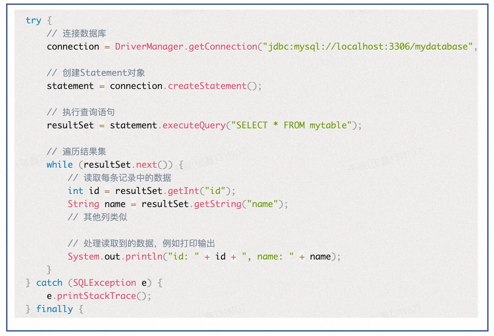
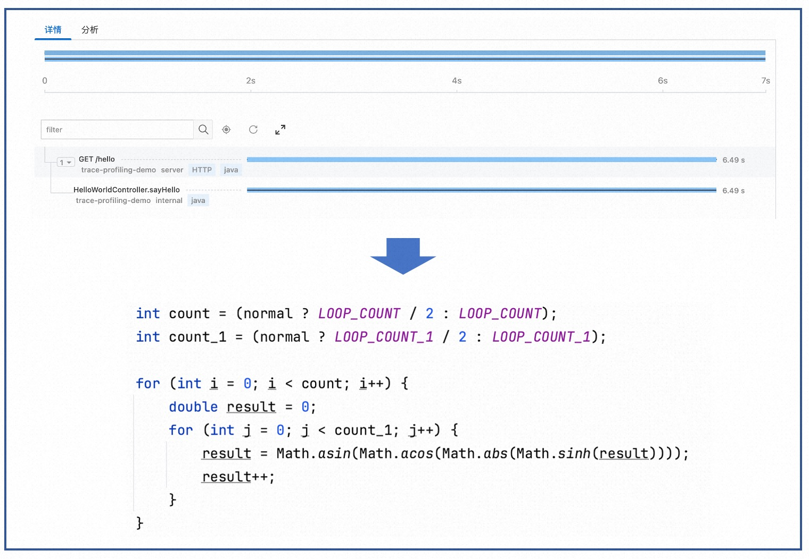
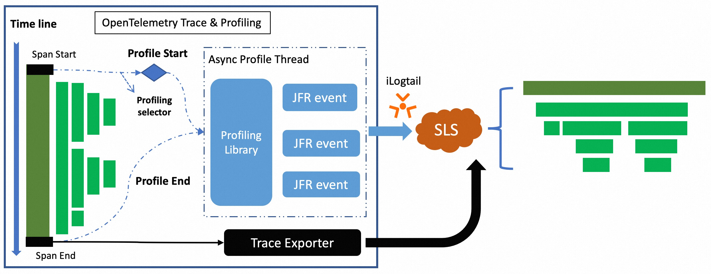
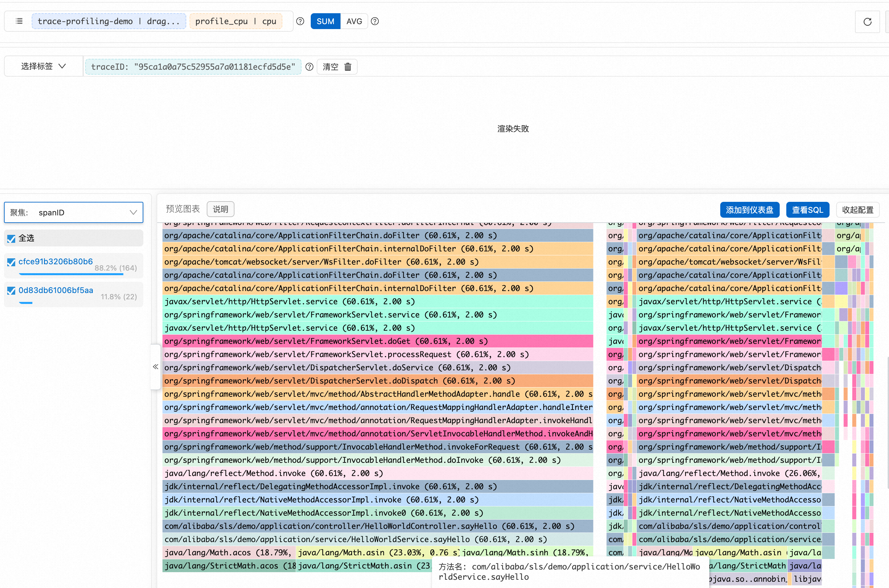

# otel-sls-extension

otel-sls-extension是一个OpenTelemetry Java Instrumentation的扩展包。用于扩展OpenTelemetry Java
Instrumentation的功能。目前支持的能力有：

1. Profiling: 通过Trace数据触发Profiling任务，采集应用程序的性能数据，包括但不限于方法执行时间、内存消耗、以及CPU使用情况等。
2. Trace + Profiling: 将Profiling数据与Trace数据关联起来，以找出应用程序中的热点方法，以及通过Profiling数据分析内存申请过多的问题。

## 背景

在微服务架构中,
OpenTelemetry为我们提供了一个强大的跟踪框架，能够捕捉到在分布式系统中服务之间传递的请求跟踪数据。这些数据对于理解请求流程和服务间的依赖关系至关重要，但当涉及到深入分析单个微服务的内部性能时，它们可能就不够用了。
比如，当我们的服务响应速度变慢或者出现超时，仅凭Trace数据可能无法完全揭示问题的本质。这时，我们需要更细致的性能分析数据，即Profiling数据，来帮助我们定位问题根因。

以下是几种常见的性能问题:

1. **内存申请过多，导致频繁GC**

   假设一个场景，我们的应用程序使用JDBC进行数据库操作，而在执行数据查询时，没有对返回的数据量进行限制。
   如图所示，一旦表数据量过大，将会造成大量的内存申请导致了频繁的GC，从而导致了应用程序的性能下降

<p align="center">
  
</p>

2. **Trace埋点稀疏，CPU执行过长，导致无法定位问题根因**

   Trace数据出于Agent对应用性能的考虑，不会针对每一行代码进行埋点的，这种选择性跟踪策略可能导致一些没有埋点的耗时代码区域在性能分析中形成盲点，使得定位问题变得更加困难。
   例如，如果一个关键业务逻辑没有被跟踪，它的性能问题可能就无法通过Trace数据被发现。而Profiling数据则可以帮助我们找到这些盲点，从而更好地理解应用程序的性能瓶颈。

<p align="center">
  
</p>

## 工作原理

otel-sls-extension的工作流程简述如下：首先，根据Profiling配置确定需要分析的Trace数据。当相应的Trace被捕获时，扩展包会触发Java
Flight Recorder (JFR)的Profiling任务，收集方法执行时间、内存消耗、CPU使用等运行时信息。采集到的Profiling数据通过ilogtail发送到日志服务，在那里可以通过Trace
ID将Profiling数据与Trace数据相关联，帮助开发者找到应用中的性能热点。

<p align="center">
  
</p>

## 快速入门

### 预备工作

1. 创建全栈可观测实例。[参见文档](https://help.aliyun.com/zh/sls/user-guide/create-an-instance-1.html)
2.

配置Profiling数据采集配置。[参见文档](https://help.aliyun.com/zh/sls/user-guide/access-the-java-program-performance-data-reported-by-the-pyroscope-sdk-or-javaagent)

### 启动应用程序

1. 下载OpenTelemetry Java
   Agent包，[下载地址](https://github.com/open-telemetry/opentelemetry-java-instrumentation/releases)
2. 下载otel-sls-extension包，[下载地址](https://github.com/aliyun-sls/otel-profiling-extension/releases)
3. 启动应用程序

```shell
java -javaagent:/path/to/opentelemetry-javaagent-all.jar \
     -Dotel.javaagent.extensions=/path/to/otel-extension.jar \
     -Dotel.profiling.config_endpoint=file:/path/to/profiling_config.yaml \
     -Dotel.service.name=trace-profiling-demo \
     -jar myapp.jar
```

4. 查看结果

   在日志服务控制台，选择对应的日志库，点击查询分析，输入以下查询语句，即可查看到Profiling数据。



## 配置

以下是otel-sls-extension的配置项说明：

| 配置项                       | 说明                                                         | 是否必填 | 默认值                   |
|---------------------------|------------------------------------------------------------|------|-----------------------|
| enabled                   | 是否开启Profiling                                              | 是    | false                 |
| maxProfilingCount         | 最大Profiling并行任务数                                           | 否    | 10                    |
| profilingIntervalMillis   | Profiling任务任务间隔                                            | 否    | 5000                  |
| agentConfigs              | Profiling Agent配置                                          | 否    |                       |
| agent.upload.server       | Profiling数据上报地址                                            | 否    | http://localhost:4040 |
| agent.timeout             | Profiling数据上报超时时间 ，单位：s(秒)                                 | 否    | 10                    |
| agent.ingest.max.tries    | Profiling数据上传重试次数                                          | 否    | 2                     |
| agent.log.level           | Profiling Agent日志级别                                        | 否    | off                   |
| agent.log.file            | Profiling Agent日志文件路径                                      | 否    |                       |
| period                    | Profiling数据上传周期，单位: s(秒)                                   | 否    | 20                    |
| cpu.engine                | CPU采集引擎，目前支持auto/async_profiler/jfr/off                    | 否    | off                   |
| wallclock.engine          | WallClock采集引擎，目前支持auto/async_profiler/off                  | 否    | off                   |
| alloc.engine              | Alloc采集引擎，目前支持auto/async_profiler/jfr/off                  | 否    | off                   |
| profilingRules            | Profiling规则配置                                              | 否    |                       |
| profilingRules.name       | Profiling规则名称                                              | 是    |                       |
| profilingRules.type       | Profiling规则类型，目前支持ROOT_SPAN, AGENT_RESOURCE, SPAN_NAME三种类型 | 是    |                       |
| profilingRules.attributes | Profiling规则属性，根据不同的规则类型，属性值也不同                             | 否    |                       |

### 配置示例

#### 配置所有Root Span进行Profiling

```yaml
enabled: true
maxProfilingCount: 10
profilingIntervalMillis: 5000
agentConfigs:
  agent.upload.server: "http://localhost:4040"
  agent.timeout: 10
  agent.ingest.max.tries: 2
  agent.log.level: off
  agent.log.file: ""
  period: 20
  cpu.engine: async_profiler
  wallclock.engine: async_profiler
  alloc.engine: async_profiler
profilingRules:
  - name: "profiling root span"
    type: ROOT_SPAN
```

#### 配置所有service.name为payment的Root Span进行Profiling

```yaml
enabled: true
maxProfilingCount: 10
profilingIntervalMillis: 5000
agentConfigs:
  agent.upload.server: "http://localhost:4040"
  agent.timeout: 10
  agent.ingest.max.tries: 2
  agent.log.level: off
  agent.log.file: ""
  period: 20
  cpu.engine: async_profiler
  wallclock.engine: async_profiler
  alloc.engine: async_profiler
profilingRules:
  - name: "profiling root span"
    type: ROOT_SPAN
  - name: "profiling all spans with some resouce attribute"
    type: AGENT_RESOURCE
    attributes:
      service.name: "payment" #例如，这里指定了service.name为payment的Span将会被采集
```

#### 配置所有Span service.name为payment，并且Span Name以`Get`开头的Span进行Profiling

```yaml
enabled: true
maxProfilingCount: 10
profilingIntervalMillis: 5000
agentConfigs:
   agent.upload.server: "http://localhost:4040"
   agent.timeout: 10
   agent.ingest.max.tries: 2
   agent.log.level: off
   agent.log.file: ""
   period: 20
   cpu.engine: async_profiler
   wallclock.engine: async_profiler
   alloc.engine: async_profiler
profilingRules:
   - name: "profiling all spans with some resouce attribute"
     type: AGENT_RESOURCE
     attributes:
        service.name: "payment" #例如，这里指定了service.name为payment的Span将会被采集
   - name: "profiling with span name"
     type: SPAN_NAME
     attributes:
        pattern: "Get*" # 支持正则表达式
```

## RoadMap

- [ ] 支持更加复杂的配置逻辑
- [ ] 支持Agent推送配置
- [ ] 支持全链路Profiling(仅限于JVM应用)
